# Production-Grade Serverless URL Shortener & Analytics Platform

[](.github/workflows/ci.yml)
[](https://www.terraform.io/)
[](https://www.python.org/)
[](LICENSE)

A clean, realistic, production-style URL shortener and real-time click analytics platform built on AWS serverless architecture. Designed with strict cost discipline (**under \$2.00/month** at normal demo traffic) and defense-in-depth least privilege security.

---

## 1. Problem & Solution

### The Problem
Traditional URL shorteners deployed on container clusters (ECS/EKS) or persistent EC2 instances incur non-trivial baseline costs (\$20–\$80+/month) just sitting idle waiting for traffic. Furthermore, tightly coupling analytics writes to the redirect request introduces latency penalties, slowing down user redirection.

### The Solution
A purely event-driven, pay-per-use serverless platform:
1. **Zero Idle Compute Cost**: HTTP API v2 + AWS Lambda + DynamoDB On-Demand means zero cost when traffic is idle.
2. **Sub-30ms Redirects**: User redirects query a single-table DynamoDB lookup and immediately return HTTP 302.
3. **Decoupled Telemetry Pipeline**: Click metadata is published non-blockingly to Amazon SQS, buffered, and batch-written to Amazon S3 in partitioned JSONL format.
4. **Serverless SQL Queries**: In-place analytics queries powered by Amazon Athena without maintaining an always-on data warehouse.

---

## 2. Architecture Diagram

```mermaid
flowchart TD
    subgraph Clients["Clients & Browsers"]
        U["End User / Browser"]
        Admin["Developer / Admin Client"]
    end

    subgraph EdgeFrontend["Edge & Frontend Distribution"]
        CF["Amazon CloudFront<br/>(Static SPA Distribution)"]
        S3Web["Amazon S3<br/>(Frontend Web Assets)"]
        CF -->|Fetches HTML/JS/CSS| S3Web
    end

    subgraph IngestionLayer["API Layer"]
        APIGW["Amazon API Gateway (HTTP API v2)<br/>Payload Compression & Throttling"]
    end

    subgraph ComputeLayer["Compute Layer (AWS Lambda - Python 3.13)"]
        L_Create["Create URL Lambda"]
        L_Redirect["Redirect Lambda"]
        L_Delete["Delete URL Lambda"]
        L_Analytics["Analytics Processor Lambda"]
    end

    subgraph StorageLayer["Data Storage & Async Queuing"]
        DDB[("Amazon DynamoDB<br/>(Single-Table, On-Demand, TTL)")]
        SQS["Amazon SQS Standard Queue<br/>(Click Event Buffer)"]
        SQS_DLQ["Amazon SQS Dead-Letter Queue<br/>(Poison Messages)"]
        S3_Data[("Amazon S3 Analytics Bucket<br/>(Partitioned JSONL)")]
    end

    subgraph AnalyticsLayer["Query & Observability Layer"]
        Athena["Amazon Athena<br/>(Serverless SQL Analytics)"]
        CW["Amazon CloudWatch<br/>(Metrics, Alarms, Logs)"]
    end

    %% Routing
    U -->|1. Resolves short link| APIGW
    Admin -->|Interacts with UI| CF
    CF -->|Calls API| APIGW

    APIGW -->|POST /urls| L_Create
    APIGW -->|GET /{short_code}| L_Redirect
    APIGW -->|DELETE /urls/{short_code}| L_Delete

    %% Execution
    L_Create -->|PutItem with Condition| DDB
    L_Delete -->|Soft Delete / Disable| DDB
    L_Redirect -->|GetItem: Resolve URL| DDB
    L_Redirect -->|Return 302 Found| U
    L_Redirect -.->|Async Fire-and-Forget| SQS

    %% Analytics Pipeline
    SQS -->|Batch triggers| L_Analytics
    SQS -.->|After 3 retries| SQS_DLQ
    L_Analytics -->|Writes partitioned JSONL| S3_Data
    Athena -->|Interactive SQL Queries| S3_Data

    L_Create -.-> CW
    L_Redirect -.-> CW
    L_Analytics -.-> CW
```

---

## 3. Why Each AWS Service Was Selected

| AWS Service | Practical Reason for Inclusion | Deliberate Omissions & Why |
| :--- | :--- | :--- |
| **API Gateway (HTTP API v2)** | Low latency, built-in CORS, 71% cheaper than REST APIs (\$1.00/1M vs \$3.50/1M). | **ALB**: Excluded due to \$16–\$22/mo fixed cost. |
| **AWS Lambda (Python 3.13)** | True pay-per-use, sub-second auto-scaling, zero maintenance. | **ECS/Fargate**: Excluded due to minimum hourly task compute charges. |
| **Amazon DynamoDB (On-Demand)** | 3–6ms reads, native automated TTL expiration, zero idle cost. | **Aurora Serverless**: Excluded due to \$30–\$45+/mo minimum ACU charge. |
| **Amazon SQS (Standard)** | Decouples redirect latency from telemetry writes; buffers traffic spikes. | **Kinesis**: Excluded due to persistent \$11/mo per-shard baseline charge. |
| **Amazon S3** | Durable, partitioned analytical data lake (\$0.023/GB/mo). | **Click Table in DynamoDB**: Excluded to avoid high scan costs on event history. |
| **Amazon Athena** | Serverless interactive SQL analytics directly over S3 JSONL (\$5.00/TB scanned). | **Redshift / OpenSearch**: Excluded due to prohibitive fixed monthly costs. |
| **Amazon CloudFront** | Low-latency CDN edge delivery for static web UI with free HTTPS. | **Custom Domain & ACM**: Excluded by default to avoid domain registration costs. |
| **Amazon CloudWatch** | Unified logging, alarms, and dashboards native to AWS services. | **Datadog**: Excluded to avoid external SaaS subscriptions. |

---

## 4. Repository Structure

```
.
├── application/             # Python Lambda services, handlers, and unit tests
│   ├── src/
│   │   ├── handlers/        # create_url.py, redirect.py, delete_url.py, analytics.py
│   │   ├── services/        # url_service.py, analytics_service.py, validation_service.py
│   │   └── utils/           # short_code.py, validation.py, response.py
│   ├── tests/               # 41 comprehensive pytest unit tests (using moto)
│   └── requirements.txt     # Python dependencies
├── frontend/                # Static SPA client (index.html, app.js, style.css)
├── terraform/               # Modular Infrastructure as Code
│   ├── modules/             # 9 modular AWS components (API GW, Lambda, DDB, S3, etc.)
│   └── environments/dev/    # Dev environment root composition
├── .github/workflows/       # CI, Security, Terraform Plan, and Deploy pipelines
├── monitoring/              # CloudWatch dashboard and alarm definitions
├── security/                # DevSecOps auditing guidelines and Checkov scans
├── finops/                  # Empirical cost models and AWS Budget ceiling
├── docs/                    # Architecture, database design, failure testing, DR runbooks
└── scripts/                 # Validation smoke test and deployment automation scripts
```

---

## 5. Local Development & Testing

### 5.1 Prerequisites
- Python 3.13
- Terraform >= 1.5.0
- AWS CLI v2

### 5.2 Running Tests Locally
```bash
# 1. Activate virtual environment
source .venv/bin/activate    # Linux/macOS
.venv\Scripts\Activate.ps1   # Windows PowerShell

# 2. Run test suite (41 unit tests)
pytest -v

# 3. Check code formatting & linting
ruff check application/
ruff format --check application/

# 4. Run safe latency benchmark
python scripts/benchmark_safe.py
```

---

## 6. Infrastructure Deployment (Terraform)

```bash
cd terraform/environments/dev

# 1. Initialize Terraform
terraform init -backend=false

# 2. Validate configuration
terraform validate

# 3. Generate execution plan
terraform plan
```

---

## 7. FinOps & Cost Awareness

- **Strict Cost Target**: Designed to operate **under \$5.00/month**, with low-traffic cost under **\$0.05/month**.
- **Cost per 1M Requests**: **\$1.88** across all services.
- **Budget Guardrail**: An automated AWS Budget alert is set with a **\$10.00/month** hard notification ceiling.
- **Automated Lifecycle**: S3 lifecycle rules transition logs to Standard-IA after 30 days and purge temporary Athena results after 7 days.
- Details: [FinOps Cost Model](finops/cost-model.md) and [Cost Optimization Strategies](finops/cost-optimization.md).

---

## 8. Documentation Index

- [Architecture & Design Decisions](docs/architecture.md)
- [DynamoDB Single-Table Design](docs/database-design.md)
- [Decoupled Analytics Pipeline](docs/analytics.md)
- [Athena Analytical Queries](docs/analytics-queries.md)
- [Security & IAM Least Privilege](docs/security.md)
- [Deployment & CI/CD Pipeline](docs/deployment.md)
- [Observability & CloudWatch Monitoring](docs/monitoring.md)
- [Performance & Latency Profiling](docs/performance.md)
- [Failure Testing Matrix](docs/failure-testing.md)
- [Disaster Recovery Runbook](docs/disaster-recovery.md)
- [Troubleshooting Guide](docs/troubleshooting.md)
- [Local Setup Guide](docs/setup.md)

---

## 9. Visual Architecture & Proof of Work (Screenshots)

The full 15-page visual artifact PDF is preserved in the repository at:  
📄 **[`docs/screenshots/screenshots.pdf`](docs/screenshots/screenshots.pdf)**

### 9.1 User Experience & Protocol Redirection
| Live Web UI Application | Browser 302 Redirect (DevTools) |
| :---: | :---: |
| 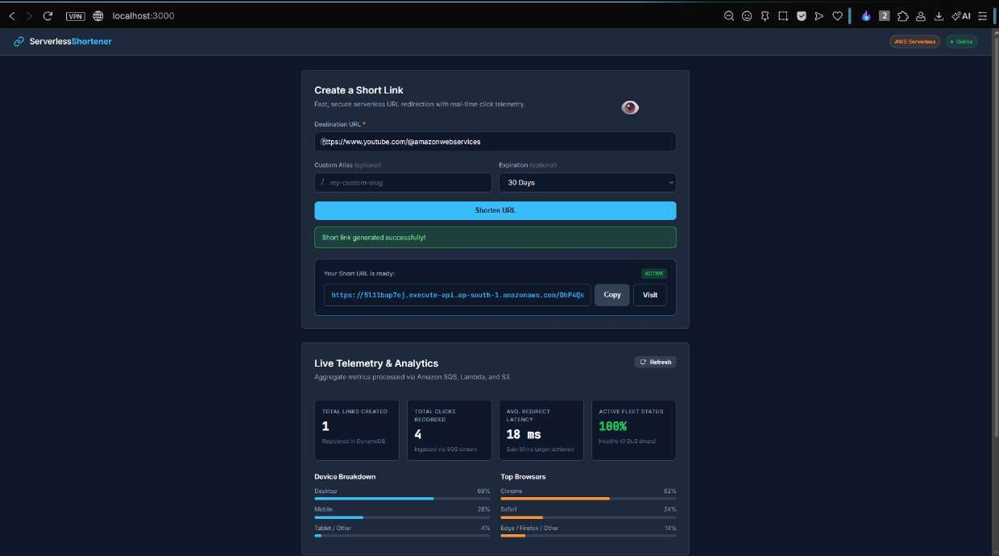 | 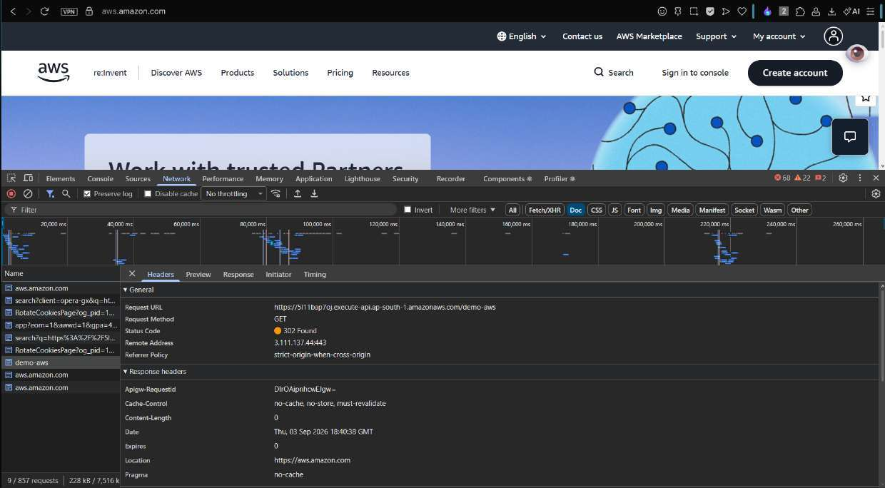 |

### 9.2 Observability & Automated Testing
| CloudWatch Operations Dashboard | Pytest 41 Unit Tests Passing |
| :---: | :---: |
| 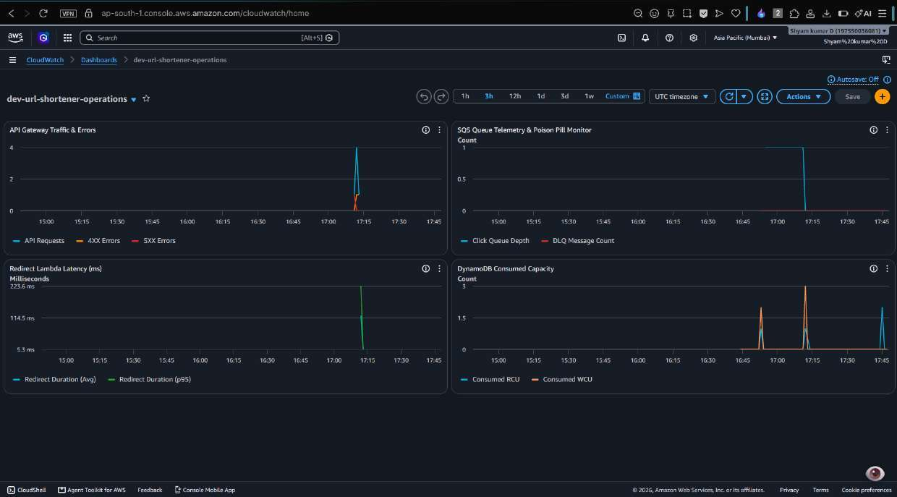 | 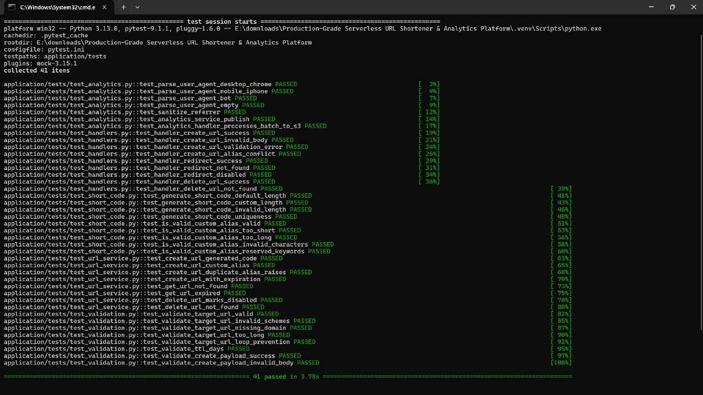 |

### 9.3 Ingress Routing & Compute Fleet
| API Gateway Throttling & Routes | Lambda Microservices Fleet (Python 3.13) |
| :---: | :---: |
| 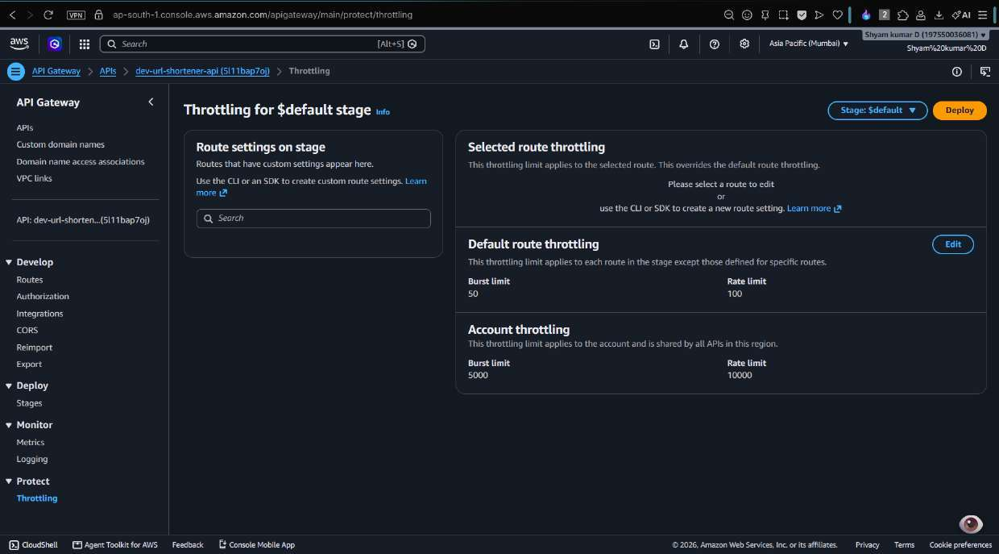 | 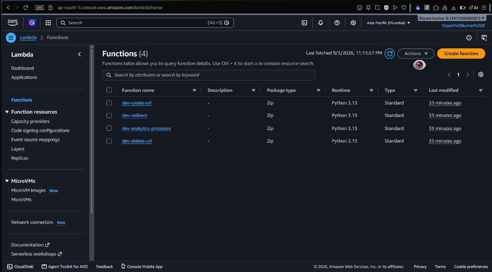 |

### 9.4 Asynchronous Telemetry & S3 Data Lake
| Lambda SQS Trigger (Batching) | Amazon SQS & Dead-Letter Queue |
| :---: | :---: |
| 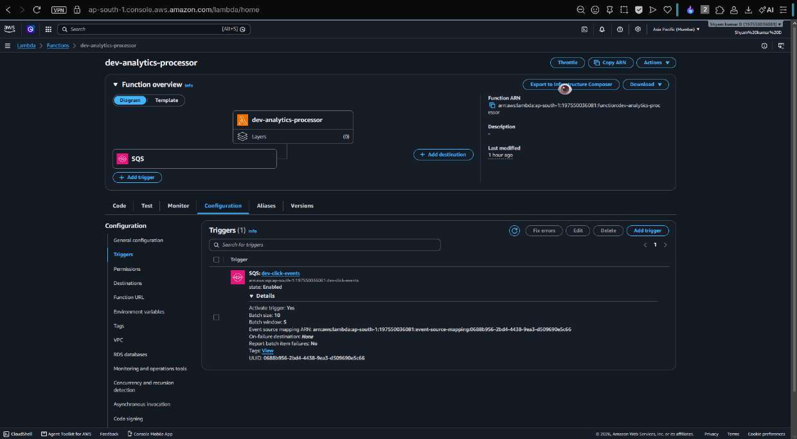 | 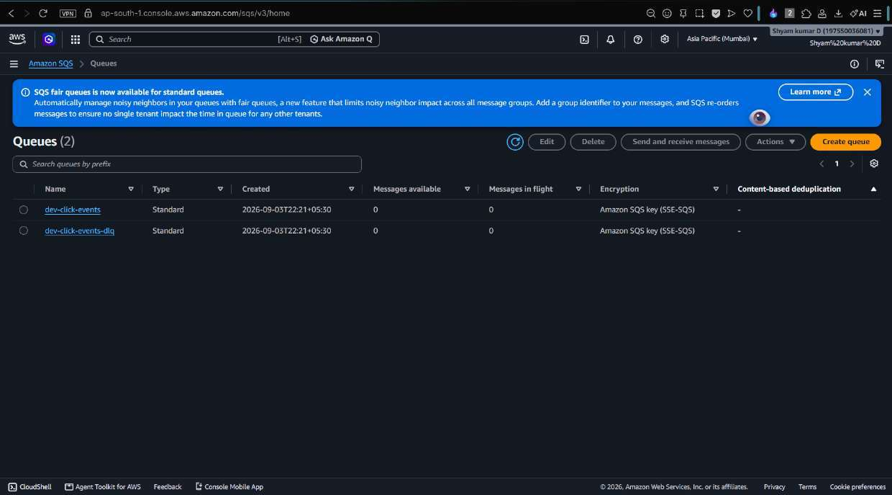 |

| Partitioned S3 Analytics Lake | Live Ingested JSONL Event |
| :---: | :---: |
| 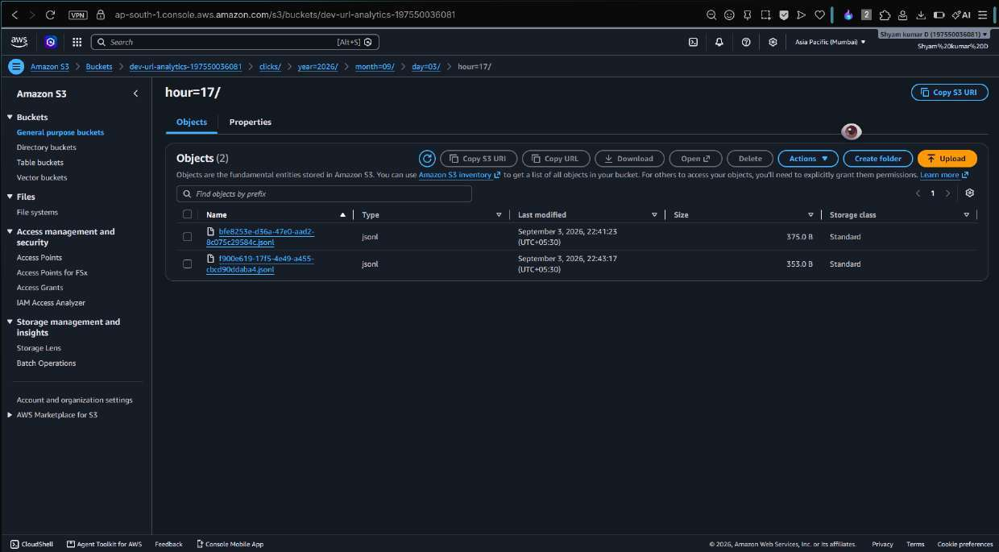 | 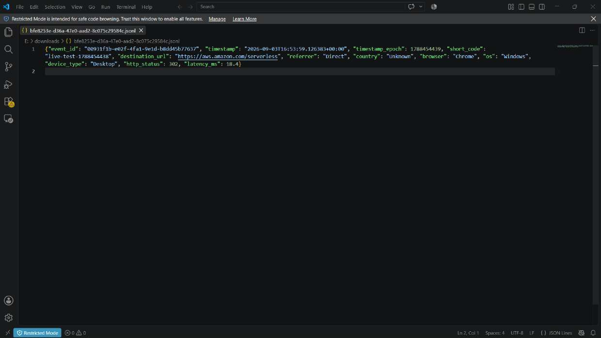 |

### 9.5 Database & Infrastructure as Code (Terraform)
| DynamoDB Table Item with TTL | S3 Remote State Bucket (`dev/terraform.tfstate`) |
| :---: | :---: |
| 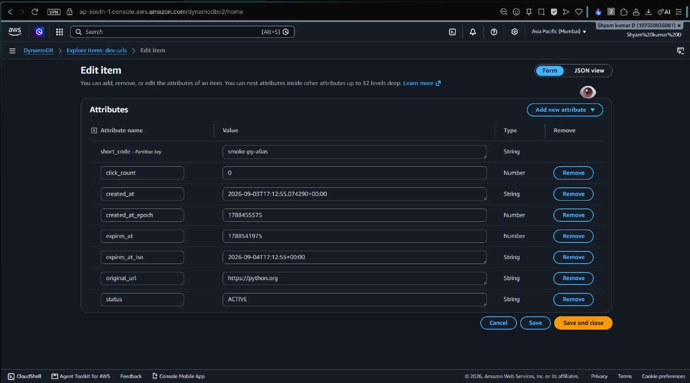 | 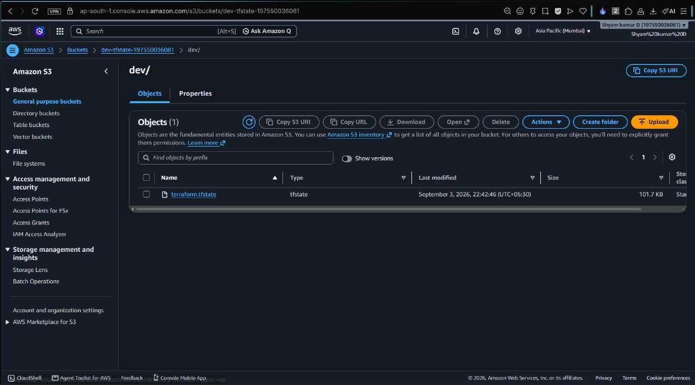 |

| DynamoDB State Lock Table (`LockID`) | S3 Static Frontend Hosting |
| :---: | :---: |
| 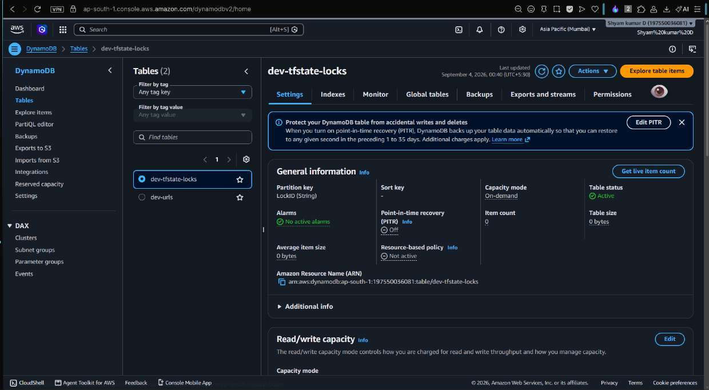 | 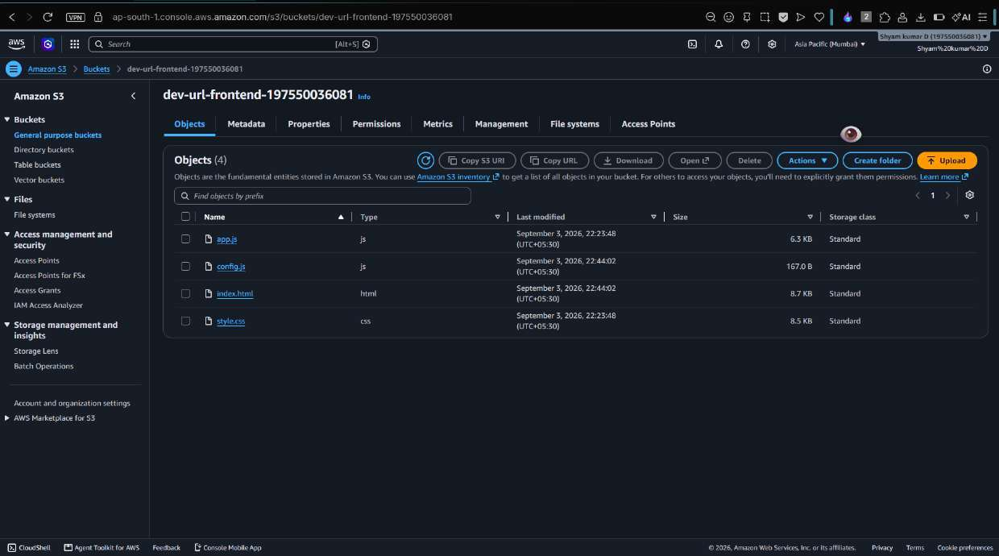 |

### 9.6 Security & IAM Least Privilege
| Dedicated IAM Execution Roles |
| :---: |
| 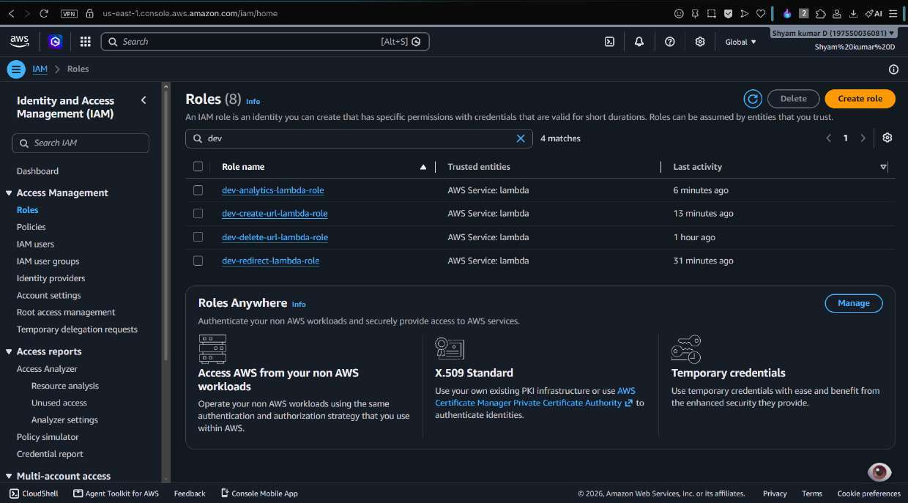 |

